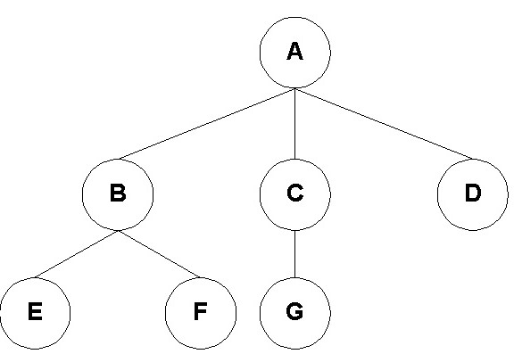
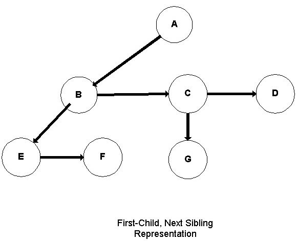

# 第14课 用C++实现的树

## 一、有根树的定义

- 定义1：树是一组节点的集合，可能是空的集合。若不为空，则一定有一个可辨始的节点R，它就是0或者多个子树的根节点。T1、T2、... TK每个子树的根节点都有一个指向树根节点R的边连接。每个子树的根称为R的子树，R称为每个子树的父树。
- 定义2：没有孩子的节点称为叶子节点，除此以外所有其他节点称为内部节点。
- 定义3：树中一个节点的子节点的个数称为该节点的度。树中节点的最大度称为该数的度。
- 定义4：具有相同父节点的节点称为同级节点。
- 空树就是没有一个节点的树。
- 节点有时称为顶点或点；边有时称为线。但是注意，边是定向边，边的指向是根。
---
如下图显示: 一个从子节点到父节点没有画出方向的树，为了方便，每个节点都被标记。树的度为3，因为树中节点的最大度数就是3(节点A)。更传统的绘制树的方法是使用无向边；这也显示在图中。


通常树都是以图解形式显示，子树由三角形表示。下面的图显示了这种表示。子树的细节隐藏在“三角形”中。


---

- 定义：从节点n1到节点nk的路径是一系列节点 n1，n2，…，nk，使得n i是n i+1的父节点，1<=i<k。此路径的长度是路径上的边数（即k-1）
- 从每个节点到自身都有一条长度为零的路径。
- 树中，每个节点到根节点只有一条路径。
- 定义:  节点的深度是从根到节点的路径长度(根在深度0处)。
- 定义：树的深度是它最深的叶子节点的深度。
- 定义：任何节点的高度是从节点到任何叶的最长路径。任何叶子的高度都是0。
- 定义：树的高度就是它的根的高度。树的高度和深度相等(主要看根节点是按1层算还是0层算，如果根节点深度按1并且和叶子节点的高度按1算，那树的高度和深度就相等，同理都按0相等，否则不相等)。
- 定义: 如果存在从节点ni到节点nj的路径，则节点ni是节点nj的祖先，节点nj是节点ni的后代。
- 每个节点都是自己的祖先和后代。不是节点本身的祖先(子孙)称为真正祖先(子孙)。

---

## 二、关于树的定理

- 有n个节点的树有n-1条边。证明：每条边都将一个节点连接到其父节点。除了根节点之外，每个节点都有一个父节点。

---

## 三、一般树的表示

树可以想象用一个结构体来表示(孩子、兄弟)

```C++
struct general_node
{
  Element_Type element;
  general_node * child1;
  general_node * child2;
  general_node * child3;
  general_node * child4;
  .
  .
  .
};
```

这种表示一个明显问题是孩子们必须足够大，才能覆盖所有预期的情况。这通常意味着要浪费很多指针。

一个更好的表示是“first-child，next-sibling”表示。

```C++
struct general_node
{
  Element_Type element;
  general_node *first_child;
  general_node *next_sibling;
};
```

下图展示的是用 “第一个子节点，下一个是兄弟” 方式表示的树:

向下的边是 “ 第一个孩子”边。水平边是 “兄弟”边。



## 四、二叉树

- 定义: 二叉树是一种树型结构，其每个节点至多只有两颗子树，并且子树有左右区分，次序不能跌倒，是有序树。
- 

下面是二叉树节点的定义。它把指针指向它的左右两个孩子。

```C++
// forward declaration
template <class Etype> class Binary_Search_Tree;
template <class Etype>
class Tree_Node
{
  protected:
    Etype Element;
    Tree_Node *Left;
    Tree_Node *Right;
    Tree_Node( Etype E = 0, Tree_Node *L = NULL, Tree_Node *R = NULL )
       : Element( E ), Left( L ), Right( R ) { }
    friend class Binary_Search_Tree<Etype>;
};
```

二叉搜索树是树节点中的友元类。

构造函数有三个参数(有默认值)。可以通过如下三种方式构造:

1. Tree_Node();
   这种情况下 元素为0，左右子树都为NULL。

2. Tree_Node(elementvalue);
   这种情况下元素类型的值是elementvalue, 左右子树为NULL。

3. Tree_Node(elementvalue, nodeptr1);
   这种情况，元素值是elementvalue, 左子树是nodeptr1 右子树为NULL。

4. Tree_Node(elementvalue, nodeptr1, nodeptr2);
   这种情况，元素值是elementvalue, 左子树值为nodeptr1 右子树值为nodeptr2。
## 五、二叉树定理
#### 定理(Theorem)1：高度为h的二叉树，有t个叶子节点，则h>=lg t
证明：如果h>=lg t ，则等价于 t<=2^h。我们通过对h的归纳证明
#### 定理(Theorem)2: 高度为h的满二叉树(FBT)有2^h个叶子节点。
#### 定理(Theorem)3: 高度为h的满二叉树(FBT)总共节点数是2^(h+1) -1
#### 定理(Theorem)4: 高度为h的完全二叉树(CBT)有n个节点，则2^h <= n<2^(h+1)
